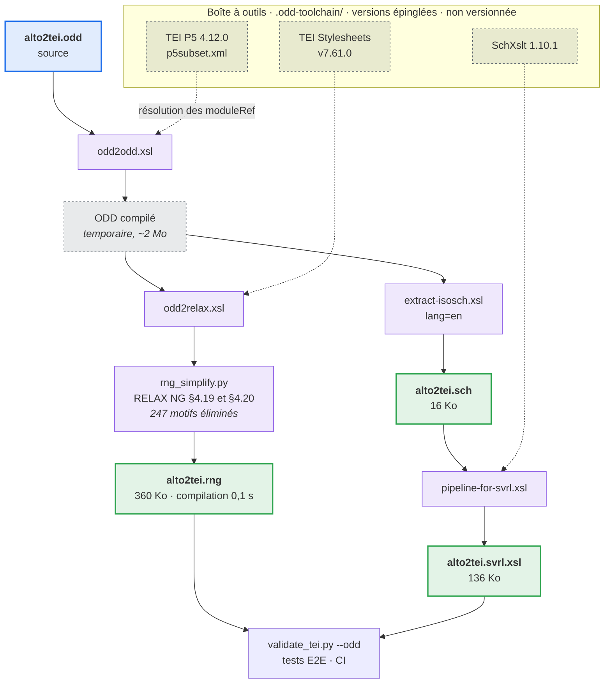

# Schéma TEI du projet

`alto2tei.odd` est la personnalisation TEI d'ALTO2TEI : la description
normative des documents que la chaîne produit. Les trois autres fichiers en
sont dérivés par `scripts/build_odd.py` et ne doivent jamais être modifiés
directement.

| Fichier | Rôle | Appliqué par |
|---|---|---|
| `alto2tei.odd` | Source. Document TEI décrivant la personnalisation. | — |
| `alto2tei.rng` | Modèle de contenu (RELAX NG). | `lxml` |
| `alto2tei.sch` | Contraintes Schematron, forme lisible. | — |
| `alto2tei.svrl.xsl` | Contraintes Schematron, forme exécutable. | `saxonche` |

## Portée

Le schéma de référence était jusqu'ici `tei_all`, soit l'intégralité des
Guidelines : environ six cents éléments, dont la chaîne en émet 98. Une
validation contre `tei_all` établit la conformité TEI, mais ne détecte ni un
type de zone inexistant, ni une `<figure>` sans ancrage, ni une entité
automatique dépourvue d'indice de certitude.

`alto2tei.odd` répond à la question complémentaire : le document est-il une
sortie conforme de *cette* chaîne. Les deux validations restent disponibles et
répondent à des questions distinctes.

La personnalisation contraint sur trois niveaux.

1. **Inventaire fermé.** Les `<moduleRef include="…">` n'importent que les
   éléments effectivement émis. La contrainte `inventaire-ferme` couvre le
   module `core`, importé entier pour les raisons exposées en
   [Contraintes d'implémentation](#contraintes-dimplémentation).
2. **Listes de valeurs fermées.** `zone/@type` reprend la taxonomie SegmOnto
   de `src/constants.py`, `rs/@type` la table d'entités de
   `src/enrichment/entity_schema.py`, `@resp` les agents déclarés.
3. **Contraintes Schematron.** Neuf règles portant sur ce qu'un modèle de
   contenu ne peut pas exprimer : complétude d'un `<choice>`, présence de
   `@cert` sur toute annotation automatique, unité de mesure sur `@n` d'un
   `<language>`, absence de césure résiduelle dans un `<reg>`, absence de
   prose dans `<langUsage>`.

Ces contraintes sont toutes locales : chacune s'évalue sur un élément et son
voisinage immédiat. Les invariants exigeant un parcours complet du document —
résolution des `@corresp`, présence d'une `<figure>` par `GraphicZone` —
restent implémentés en Python dans `scripts/validate_tei.py`, qui les traite
en un seul passage. Exprimés en Schematron, ils seraient quadratiques sur des
documents de cent mille éléments.

## Chaîne de compilation



Le moteur XSLT est SaxonC-HE, distribué comme roue pip (`saxonche`) : XSLT 2.0
sans JVM ni ant, contrairement aux scripts shell fournis avec les Stylesheets.
La compilation complète s'exécute en moins d'une seconde.

Les versions de la boîte à outils sont épinglées en tête de
`scripts/build_odd.py`. Les relever constitue une modification délibérée : il
faut alors recompiler et examiner le diff des schémas produits.

## Utilisation

```bash
# Validation contre le schéma du projet : RELAX NG puis Schematron
venv/bin/python scripts/validate_tei.py --odd tei_output/*.xml

# Validation contre tei_all, si une copie est disponible (non versionnée, ~1 Mo)
venv/bin/python scripts/validate_tei.py --schema tei_all.rng tei_output/*.xml
```

Les tests de bout en bout valident la sortie contre `alto2tei.rng` à chaque
exécution : le schéma étant versionné, ce contrôle ne peut pas être sauté. La
partie Schematron est ignorée, avec un motif explicite, lorsque `saxonche`
n'est pas installé.

## Régénération

```bash
venv/bin/python scripts/build_odd.py            # après toute modification de l'ODD
venv/bin/python scripts/build_odd.py --check    # les dérivés correspondent-ils à la source
venv/bin/python scripts/build_odd.py --refresh  # re-télécharge la boîte à outils
```

`--check` recompile dans un répertoire temporaire et compare aux fichiers
versionnés, en ignorant la seule date de génération que les Stylesheets
inscrivent dans leur sortie.

## Contraintes d'implémentation

Les deux points suivants ne sont pas déductibles de la documentation TEI et
conditionnent la structure de l'ODD.

### Classes de modèle vides et motifs impossibles

Les modèles de contenu TEI référencent des **classes de modèle** — des groupes
nommés d'éléments interchangeables — et non des éléments individuels : un
`<p>` admet « tout membre de `model.phrase` ».

Une personnalisation qui n'importe qu'une partie de la TEI vide certaines de
ces classes : sans encodage de vers, `model.lLike` n'a plus aucun membre.
`odd2relax` rend une classe vide par `<notAllowed/>`, motif RELAX NG qui ne
reconnaît rien. La construction est exacte, mais la classe apparaît à
l'intérieur de séquences, où la spécification impose une réduction (§4.20) :

```
group(notAllowed, X)   →  notAllowed
zeroOrMore(notAllowed) →  empty
```

libxml2 n'effectue pas ces réductions et construit son automate avec les
motifs impossibles en place. Deux conséquences ont été observées :

- explosion combinatoire — la compilation du schéma n'aboutissait pas après
  dix minutes ;
- contamination des modèles de contenu — sur une variante qui compilait, un
  `<zone>` n'acceptait plus de `<zone>` imbriqué, et le schéma rejetait des
  documents conformes.

`scripts/rng_simplify.py` applique donc ces réductions avant que lxml ne lise
le fichier. La langue reconnue par le schéma est inchangée : seule son
écriture l'est. Effet mesuré : 247 motifs éliminés, compilation ramenée à
0,1 s.

Les règles portant sur `<empty/>` (§4.19) sont également nécessaires, la
réduction d'un `notAllowed` en produisant : un `zeroOrMore(empty)` subsistant
faisait rejeter les `<person>` d'un `<listPerson>`.

Le module `core` reste incompilable après simplification et doit être importé
entier ; la cause n'a pas été identifiée. La contrainte `inventaire-ferme`
rétablit pour ce module l'inventaire que le modèle de contenu ne porte plus.

### Sélection linguistique des contraintes

Un ODD peut documenter ses spécifications en plusieurs langues. À
l'extraction, `extract-isosch` détermine la langue d'une contrainte en
remontant à son premier ancêtre déclarant un `@xml:lang`, avec `en` par
défaut, et écarte celles qui ne correspondent pas à la langue demandée.

Un `xml:lang="fr"` sur l'élément racine de l'ODD suffit donc à écarter la
totalité des contraintes du projet lors d'une extraction en `en`. L'échec est
silencieux : la compilation réussit, le fichier `.sch` est produit et contient
les contraintes propres à la TEI, et la validation passe — les règles
susceptibles d'échouer en étant absentes.

Deux mesures préviennent ce cas : la prose française est marquée sur les
`<div>` qui la portent, jamais au-dessus du `<schemaSpec>` ; et
`tests/test_odd.py` échoue si une contrainte déclarée dans l'ODD est absente
du Schematron produit.

## Procédure de modification

1. Modifier `alto2tei.odd`.
2. Recompiler : `venv/bin/python scripts/build_odd.py`.
3. Vérifier : `venv/bin/python -m pytest tests/test_odd.py tests/test_e2e_pipeline.py`.
4. Committer la source et les trois fichiers dérivés dans le même commit.

L'ajout d'un élément à la sortie de la chaîne impose son ajout à l'inventaire
de l'ODD ; `tests/test_odd.py` échoue tant que ce n'est pas fait.
