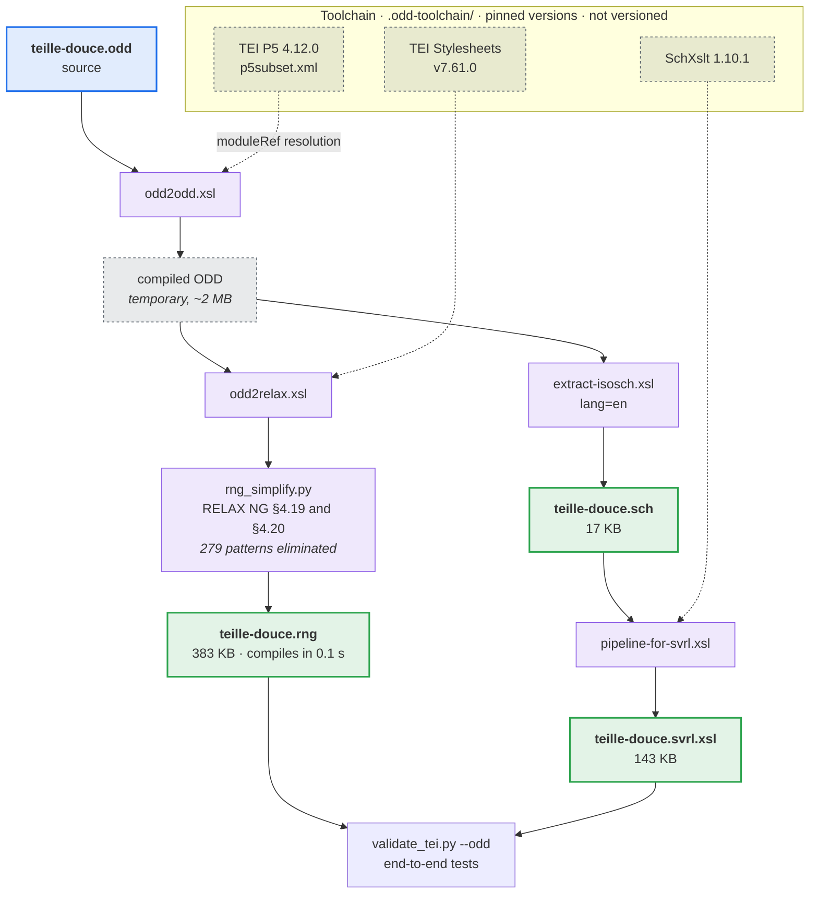

# The project's TEI schema

`teille-douce.odd` is the TEI customization of TEIlle-douce: the normative description
of the documents the pipeline produces. The three other files are derived from
it by `scripts/build_odd.py` and must never be edited directly.

| File | Role | Applied by |
|---|---|---|
| `teille-douce.odd` | Source. A TEI document describing the customization. | — |
| `teille-douce.rng` | Content model (RELAX NG). | `lxml` |
| `teille-douce.sch` | Schematron constraints, readable form. | — |
| `teille-douce.svrl.xsl` | Schematron constraints, executable form. | `saxonche` |

For the practical side — what each rule catches, how to validate, how to change
the schema — see [`docs/schema.md`](../docs/schema.md). This file documents the
compilation chain and the two implementation constraints that shape it.

## Scope

The reference schema used to be `tei_all`, that is the whole Guidelines: about
six hundred elements, of which the pipeline emits 118. Validating against
`tei_all` establishes TEI conformance, but detects neither a zone type that does
not exist, nor a `<figure>` with no anchor, nor an automatic entity carrying no
indication of certainty.

`teille-douce.odd` answers the complementary question: is this document a conformant
output of *this* pipeline. Both validations remain available and answer distinct
questions.

The customization constrains on three levels.

1. **A closed inventory.** The `<moduleRef include="…">` elements import only
   what is actually emitted. The `inventaire-ferme` constraint covers the `core`
   module, which is imported whole for the reasons set out under
   [Implementation constraints](#implementation-constraints).
2. **Closed value lists.** `zone/@type` mirrors the SegmOnto taxonomy in
   `teille_douce/constants.py`, `rs/@type` the entity table in
   `teille_douce/enrichment/entity_schema.py`.
3. **Schematron constraints.** Eleven specifications covering what a content
   model cannot express: the completeness of a `<choice>`, the presence of
   `@cert` on every automatic annotation, the unit of measure on a
   `<language>`'s `@n`, the absence of a residual line-break hyphen in a
   `<reg>`, the absence of prose in `<langUsage>`.

These constraints are all local: each evaluates on an element and its immediate
neighbourhood. Invariants requiring a full traversal of the document — resolving
`@corresp`, checking that each `GraphicZone` has a `<figure>` — stay implemented
in Python in `scripts/validate_tei.py`, which handles them in a single pass.
Expressed in Schematron they would be quadratic over documents of a hundred
thousand elements.

## Compilation chain



The XSLT engine is SaxonC-HE, distributed as a pip wheel (`saxonche`): XSLT 2.0
with neither JVM nor ant, unlike the shell scripts shipped with the Stylesheets.
A full compilation runs in under a second.

The toolchain versions are pinned at the top of `scripts/build_odd.py`. Raising
them is a deliberate change: recompile, then examine the diff of the generated
schemas.

## Usage

```bash
# Validation against the project schema: RELAX NG, then Schematron
venv/bin/python scripts/validate_tei.py --odd tei_output/*.xml

# Over a corpus: documents are independent
venv/bin/python scripts/validate_tei.py --odd -j 8 tei_output/*.xml

# Validation against tei_all, if a copy is available (not versioned, ~1 MB)
venv/bin/python scripts/validate_tei.py --schema tei_all.rng tei_output/*.xml
```

Five local invariants — prose in `<langUsage>`, an unsplit IIIF `idno`, a
residual hyphen in a `<reg>`, a `GraphicZone` with no `xml:id`, a placeholder
ORCID — are stated **exactly once**, in the ODD. They used to be stated in
Python as well, and the two versions had diverged: different severities,
different scopes, and the Python hyphenation check missed enriched `<reg>`
elements whose text lives inside `<w>`. A call without `--odd` therefore does not
check them, and the script says so rather than letting a reader believe the check
was complete. Rules the TEI marks `role="nonfatal"` remain warnings.

The end-to-end tests validate the output against `teille-douce.rng` on every run:
the schema being versioned, that check cannot be skipped. The Schematron half is
skipped, with an explicit reason, when `saxonche` is not installed.

## Regeneration

```bash
venv/bin/python scripts/build_odd.py            # after any change to the ODD
venv/bin/python scripts/build_odd.py --check    # do the derivatives match the source?
venv/bin/python scripts/build_odd.py --refresh  # re-download the toolchain
```

`--check` recompiles into a temporary directory and compares against the
versioned files, ignoring only the generation date the Stylesheets stamp into
their output.

## Cost

Roughly 0.7 s per MB, so about thirty seconds for a 39 MB document of 135,000
elements. The measured breakdown:

| Step | Share |
|---|---|
| XML parsing | 0.2 s |
| RELAX NG (lxml) | 16 s |
| Schematron (Saxon) | 8 s |
| Python checks | 1 s |

Two things explain why it is not worse. The TEI first typed `@points` as a
**list** of points, each validated against a pattern: libxml2 was thereby
checking 539,000 coordinates per document, and RELAX NG validation alone took
56 s instead of 3. The type is narrowed to a string and the shape of the list is
stated in Schematron (`coordonnees-bien-formees`), where Saxon checks it in a
second — the same requirement, forty times cheaper.

And `-j N` spreads the files over N cores: four documents totalling 111 MB go
from 72 s to 30 s on four cores, the floor being the largest file in the batch.

## Implementation constraints

The two points below are not deducible from the TEI documentation, and they
determine the structure of the ODD.

### Empty model classes and impossible patterns

TEI content models reference **model classes** — named groups of interchangeable
elements — rather than individual elements: a `<p>` admits "any member of
`model.phrase`".

A customization importing only part of the TEI empties some of those classes:
with no verse encoding, `model.lLike` has no members left. `odd2relax` renders
an empty class as `<notAllowed/>`, a RELAX NG pattern matching nothing. The
construction is correct, but the class appears inside sequences, where the
specification requires a reduction (§4.20):

```
group(notAllowed, X)   →  notAllowed
zeroOrMore(notAllowed) →  empty
```

libxml2 does not perform these reductions and builds its automaton with the
impossible patterns still in place. Two consequences were observed:

- combinatorial explosion — schema compilation had not finished after ten
  minutes;
- contamination of content models — on a variant that did compile, a `<zone>`
  no longer accepted a nested `<zone>`, and the schema rejected conformant
  documents.

`scripts/rng_simplify.py` therefore applies these reductions before lxml reads
the file. The language the schema recognizes is unchanged; only its writing is.
Measured effect: 279 patterns eliminated, compilation down to 0.1 s.

The rules covering `<empty/>` (§4.19) are necessary too, since reducing a
`notAllowed` produces one: a surviving `zeroOrMore(empty)` was making the
`<person>` elements of a `<listPerson>` be rejected.

The `core` module remains incompilable after simplification and has to be
imported whole; the cause has not been identified. The `inventaire-ferme`
constraint restores for that module the inventory its content model no longer
carries.

### Language-based selection of constraints

An ODD may document its specifications in several languages. At extraction
time, `extract-isosch` determines a constraint's language by walking up to its
nearest ancestor declaring an `@xml:lang`, defaulting to `en`, and discards
those that do not match the language requested.

An `xml:lang="fr"` on the root element of the ODD is therefore enough to discard
*every* project constraint during an `en` extraction. The failure is silent:
compilation succeeds, the `.sch` file is produced and contains the TEI's own
constraints, and validation passes — the rules liable to fail being absent.

Two measures prevent this case: French prose is marked on the `<div>` elements
carrying it, never above the `<schemaSpec>`; and `tests/test_odd.py` fails if a
constraint declared in the ODD is missing from the generated Schematron.

## Modification procedure

1. Edit `teille-douce.odd`.
2. Recompile: `venv/bin/python scripts/build_odd.py`.
3. Verify: `venv/bin/python -m pytest tests/test_odd.py tests/test_e2e_pipeline.py`.
4. Commit the source and the three derived files in the same commit.

Adding an element to the pipeline's output requires adding it to the ODD's
inventory; `tests/test_odd.py` fails until that is done.
